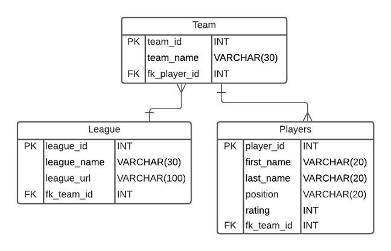

# NFL Fantasy League
## _devops-fundamental-project_
---
## Contents
* [Objective](#objective) 
* [Outline](#outline) 
* [Continuous-Integration-Pipeline](#continuous-integration-pipeline)
* [Risk-Assessment](#risk-assessment)  
* [Scrum-Board](#scrum-board)
* [Entity-Relationship-Diagram](#entity-relationship-diagram)
---
## Objective

The overall objective with this project is the following: 

	- To create a CRUD application with utilisation of supporting tools, 
	  methodologies and technologies that encapsulate all core modules 
	  covered during training. 
---
## Outline

The application being created for this project will be a NFL fantasy football league. The CRUD functionality was updated to discount user logins, as this feature was out of scope for the project. The initial CRUD outline that was planned can be found [here.](./initial-crud.md)

Users will be able to:
* **Create** an NFL fantasy league.
* **Create** an NFL fantasy team by picking available NFL players from a list.
---
* **Read** the NFL teams that belong to a fantasy league.
* **Read** a list of players that belong to each fantasy NFL team.
---
* **Update** team roster (e.g. Add/remove players or move up some players from the bench).
---
* **Delete** a fantasy team.
* **Delete** a fantasy league.
---
## Continuous-Integration-Pipeline

The tech stack required would be the following: 

	- Kanban Board: Trello or an equivalent Kanban Board 
	- Database: GCP SQL Server or other Cloud Hosted managed Database. 
	- Programming language: Python 
	- Unit Testing with Python (Pytest) 
	- Integration Testing with Python (Selenium) 
	- Front-end: Flask (HTML) 
	- Version Control: Git 
	- CI Server: Jenkins 
	- Cloud server: GCP Compute Engine
---

## Risk-Assessment

Here is a link to my [Risk Assessment](https://qalearning-my.sharepoint.com/:x:/r/personal/gwilliams_qa_com/_layouts/15/Doc.aspx?sourcedoc=%7B7FD04526-D564-496A-96F8-6422906C291D%7D&file=Risk%20Assessment.xlsx&wdOrigin=OFFICECOM-WEB.START.REC&ct=1626710319117&action=default&mobileredirect=true&wdLOR=c7EE92B46-79E5-4BBE-AB20-35CBAE3EAF72&cid=59cf5c39-c7d5-4e74-a919-d19be51b63c2)
, where I have detailed descriptions of the potential risks and control measures associated with this project.

---
## Scrum-Board

I decided to use Jira for my Scrum Board, as I like the general layout and options it gives to the user.
Here is a link to my [Scrum Board.](https://team-1624354737559.atlassian.net/jira/software/projects/DFP/boards/4/roadmap)

---
## Entity-Relationship-Diagram
	
Here is the initial Entity-Relationship Diagram (ERD) for this project:
	

---
Here is the later version of the ERD, created to reflect change in CRUD functionality where user logins are no longer required:

