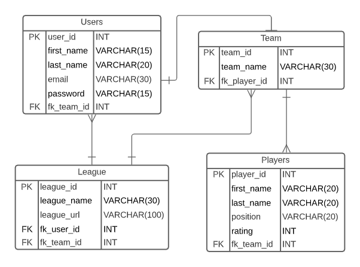

# NFL Fantasy League
## _devops-fundamental-project_

## Contents
* [Objective](#objective) 
* [Outline](#outline) 
* [Continuous-Integration-Pipeline](#continuous-integration-pipeline)  
* [Scrum-Board](#scrum-board)
* [Entity-Relationship-Diagram](#entity-relationship-diagram)

## Objective

The overall objective with this project is the following: 

	- To create a CRUD application with utilisation of supporting tools, 
	  methodologies and technologies that encapsulate all core modules 
	  covered during training. 
## Outline

The application being created for this project will be a NFL fantasy football league.  
Users will be able to:
* **Create** an account.
* **Create** their own NFL fantasy league where they can compete with the other players that are invited to that league.
* **Create** a fantasy team by picking available NFL players from a list.
----------------------------------------------------------------------------------------------------------
* **Read** the NFL teams that belong to the other players in that fantasy league.
* **Read** previous and upcoming matchups between the NFL teams in their fantasy league.
----------------------------------------------------------------------------------------------------------
* **Update** their team roster for upcoming matchups (e.g. move up some players from the bench).
* **Update** their profile information.
----------------------------------------------------------------------------------------------------------
* **Delete** their account.
* **Delete** their fantasy team.
* **Delete** their fantasy league (if they are the designated league owner who created the fantasy league).
## Continuous-Integration-Pipeline

The tech stack required would be the following: 

	- Kanban Board: Trello or an equivalent Kanban Board 
	- Database: GCP SQL Server or other Cloud Hosted managed Database. 
	- Programming language: Python 
	- Unit Testing with Python (Pytest) 
	- Integration Testing with Python (Selenium) 
	- Front-end: Flask (HTML) 
	- Version Control: Git 
	- CI Server: Jenkins 
	- Cloud server: GCP Compute Engine
## Scrum-Board

I decided to use Jira for my Scrum Board, as I like the general layout and options it gives to the user.
Here is a link to my [Scrum Board.](https://team-1624354737559.atlassian.net/jira/software/projects/DFP/boards/4/roadmap)
## Entity-Relationship-Diagram
	
Here is the initial Entity-Relationship Diagram (ERD) for this project:
	
	
