# NFL Fantasy League
## _devops-fundamental-project_
---
## Contents
* [Objective](#objective) 
* [Outline](#outline) 
* [Continuous-Integration-Pipeline](#continuous-integration-pipeline)
* [Risk-Assessment](#risk-assessment)  
* [Scrum-Board](#scrum-board)
* [Entity-Relationship-Diagram](#entity-relationship-diagram)
* [Unit-Testing-in-VS-Code](#unit-testing-in-vs-code)
* [Unit-Testing-with-CI-server](#unit-testing-with-ci-server)
---
 

## Objective

The overall objective with this project is the following: 

	- To create a CRUD application with utilisation of supporting tools, 
	  methodologies and technologies that encapsulate all core modules 
	  covered during training. 
---
 

## Outline

The application being created for this project will be a NFL fantasy football league. The CRUD functionality was updated to discount user logins, as this feature was out of scope for the project. The initial CRUD outline that was planned can be found [here.](./initial-crud.md)

Users will be able to:
* **Create** an NFL fantasy league.
* **Create** an NFL fantasy team by picking available NFL players from a list.
---
* **Read** the NFL teams that belong to a fantasy league.
* **Read** a list of players that belong to each fantasy NFL team.
---
* **Update** team roster (e.g. Add/remove players or move up some players from the bench).
---
* **Delete** a fantasy team.
* **Delete** a fantasy league.
---
 

## Continuous-Integration-Pipeline

The tech stack I used for this project is as follows: 

	- Scrum Board: Jira
	- Database: GCP SQL Server 
	- Programming language: Python 
	- Unit Testing with Python: Pytest  
	- Front-end: Flask
	- Version Control: GitHub
	- CI Server: Jenkins 
	- Cloud server: GCP Compute Engine
---
 

## Risk-Assessment

Here is a link to my [Risk Assessment](https://qalearning-my.sharepoint.com/:x:/r/personal/gwilliams_qa_com/_layouts/15/Doc.aspx?sourcedoc=%7B7FD04526-D564-496A-96F8-6422906C291D%7D&file=Risk%20Assessment.xlsx&wdOrigin=OFFICECOM-WEB.START.REC&ct=1626710319117&action=default&mobileredirect=true&wdLOR=c7EE92B46-79E5-4BBE-AB20-35CBAE3EAF72&cid=59cf5c39-c7d5-4e74-a919-d19be51b63c2)
, as well as the image below where I have detailed descriptions of the potential risks and control measures associated with this project.

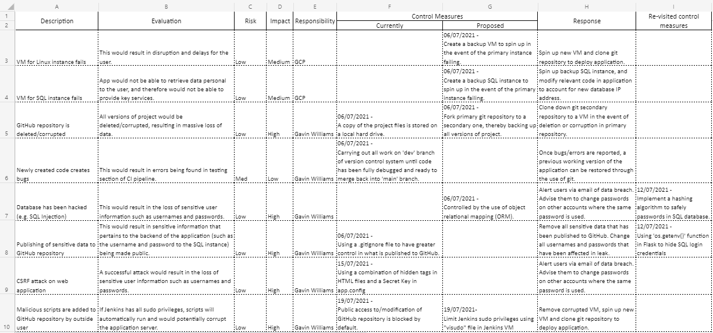

---
 

## Scrum-Board

I decided to use Jira for my Scrum Board, as I like the general layout and options it gives to the user.
Here is a link to my [Scrum Board.](https://team-1624354737559.atlassian.net/jira/software/projects/DFP/boards/4/roadmap)

My completed project road map is as follows:

Firstly, I planned a list of tasks from a project development standpoint, such as writing out a risk assessment and designing an ERD diagram.

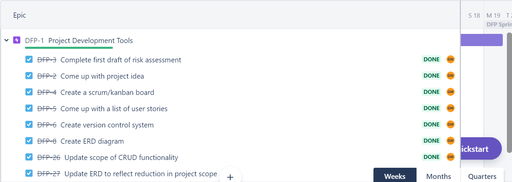

---
 

Secondly, I wrote a list of user stories. These were a guide to what I wanted the functionality of my application to incorporate, such as allowing the user to create multiple teams in a fantasy league.

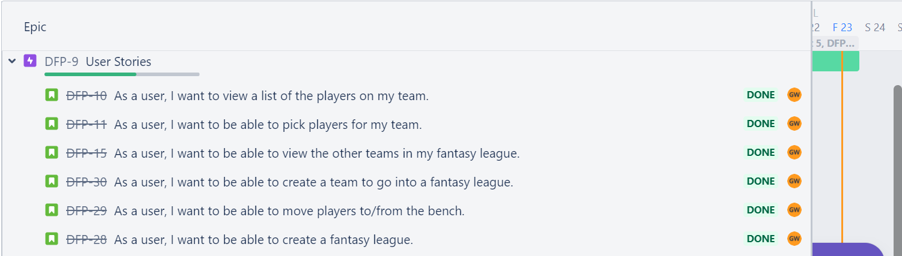
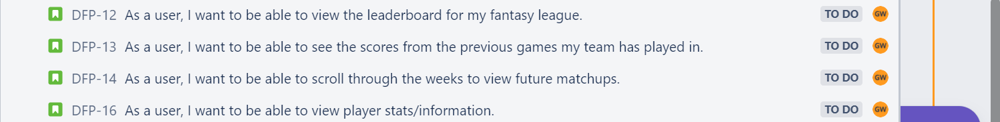

---
 

Lastly, I planned a list of tasks based off of creating a continuous integration (CI) pipeline for my flask application.

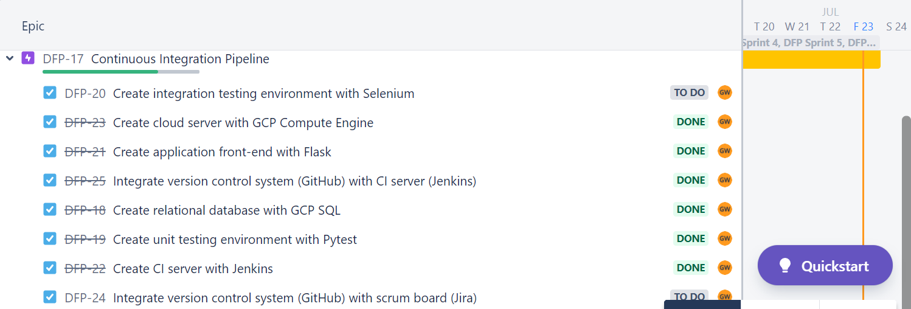

---
 

## Entity-Relationship-Diagram
	
Here is the initial Entity-Relationship Diagram (ERD) for this project, which incorporates user logins:
	

---
 
Here is the final version of the ERD, created to reflect the change in CRUD functionality where user logins are no longer required, and thus has one less table. I also simplified the League and Players tables, where a league URL would not need to be stored in the database, and a player rating would be desirable, but ultimately not necessary for the scope of this application. One small addition I made was to include an "active" attribute to each player, which allows the user to mark each player as active or inactive. This function meets the user story example of wanting to move players to/from the bench.

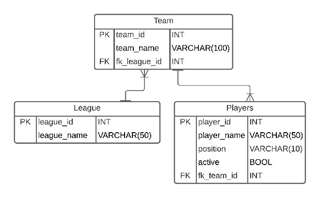

---
 

## Unit-Testing-in-VS-Code

Here is the testing output carried out after completing the application, giving 100% coverage of the "application" directory:

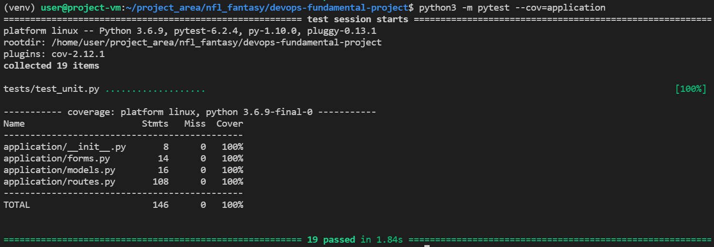

---
 

## Unit-Testing-with-CI-server

Here is the testing output using Jenkins with JUnit and Cobertura coverage reports:

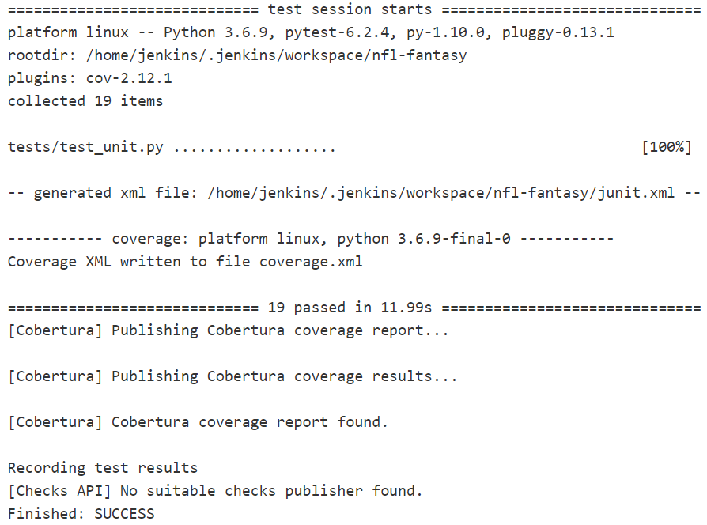

---
 

Here is the Cobertura coverage report:

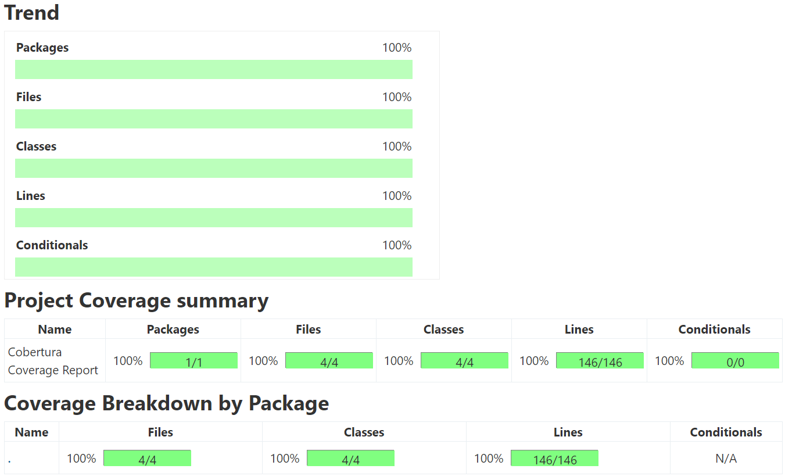

---
 

Here is the JUnit test output, split up into each test class:

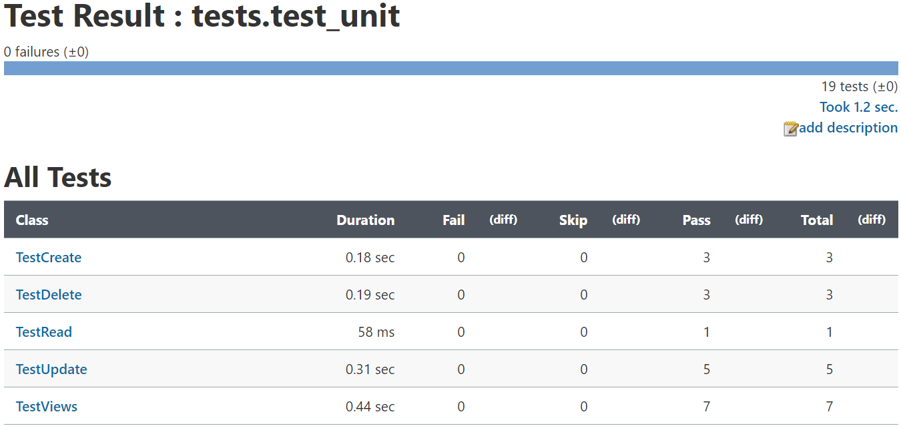

---
 

Here is the webhook configured to trigger a Jenkins build once there has been a push to GitHub:

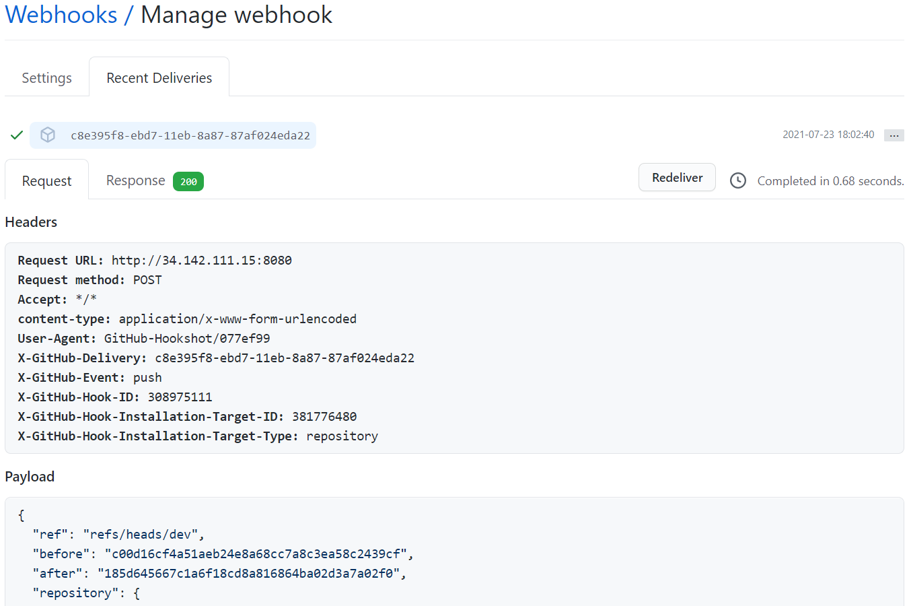

